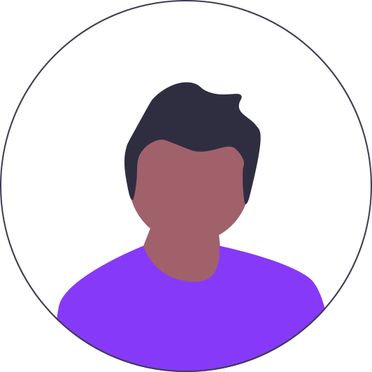

## 👋 Hey there
Hello readers, my name is **Vivek Vaish** and I am pursuing a B.Tech degree from [**Galgotias University**](https://www.galgotiasuniversity.edu.in/), Greater Noida.
 
 

## 🧑‍💻 About Me
* 😀 I'm an intermediate programmer.
* 🔍 I am interested in Software development, Web development and new technologies about them.
* 🌱 I am currently learning.
 

## ✅ What I've Created
| Project Name | Project Description |
|:------------:|---------------------|
| Personal Portfolio | I have created my website to show all my tech-related skills to the world. You can check out from [**here**](https://vivekv634.github.io/Portfolio). |
| Notepad Clone | When I was new to programming, I learned Python and from Python, I cloned Microsoft's Notepad as my first project. Checkout from [**here**](https://github.com/Vivekv634/Notepad-clone). |
| EMS | EMS (Employee Management System) was built using C++ programming language to secure and manipulate the Employee's data. Check this out from [**here**](https://github.com/Vivekv634/EMS-cpp). |
| To-Do List App | I created this app out of JavaScript to maintain all my tasks throughout the day. It saves and reloads all your task data whenever the browser reloads, reopened and closed. Checkout from [**here**](https://github.com/Vivekv634/EMS-cpp). |
 

## 💼 Tech Stack

&nbsp;&nbsp;&nbsp;&nbsp;
&nbsp;&nbsp;&nbsp;&nbsp;
&nbsp;&nbsp;&nbsp;&nbsp;
&nbsp;&nbsp;&nbsp;&nbsp;
&nbsp;&nbsp;&nbsp;&nbsp;
&nbsp;&nbsp;&nbsp;&nbsp;
&nbsp;&nbsp;&nbsp;&nbsp;
&nbsp;&nbsp;&nbsp;&nbsp;
&nbsp;&nbsp;&nbsp;&nbsp;
&nbsp;&nbsp;&nbsp;&nbsp;

 

<!--START_SECTION:waka-->
<!--END_SECTION:waka-->

## 🙌 Contact Me
&nbsp;&nbsp;&nbsp;&nbsp;
&nbsp;&nbsp;&nbsp;&nbsp;
&nbsp;&nbsp;&nbsp;&nbsp;
 
